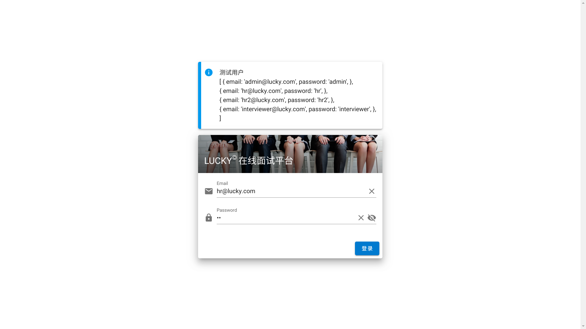
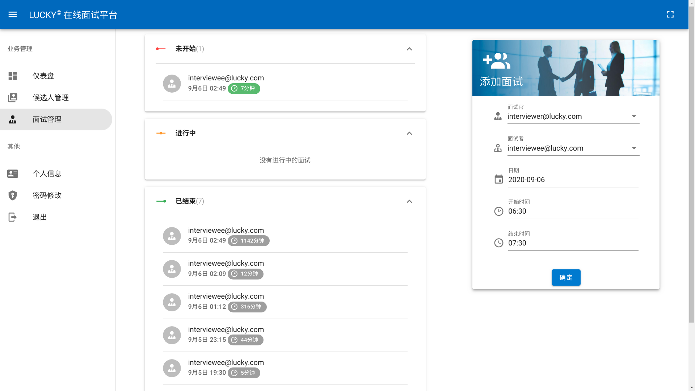
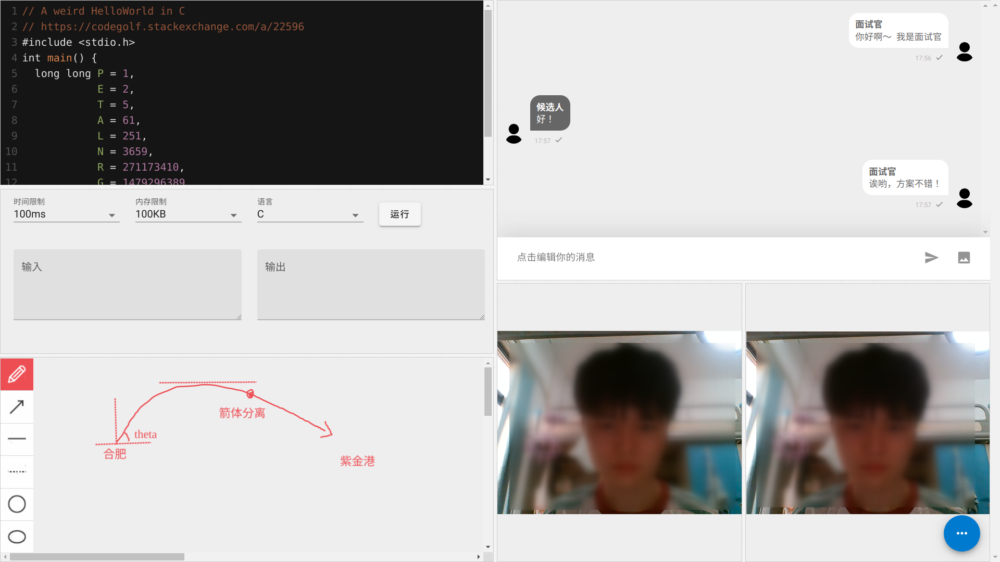
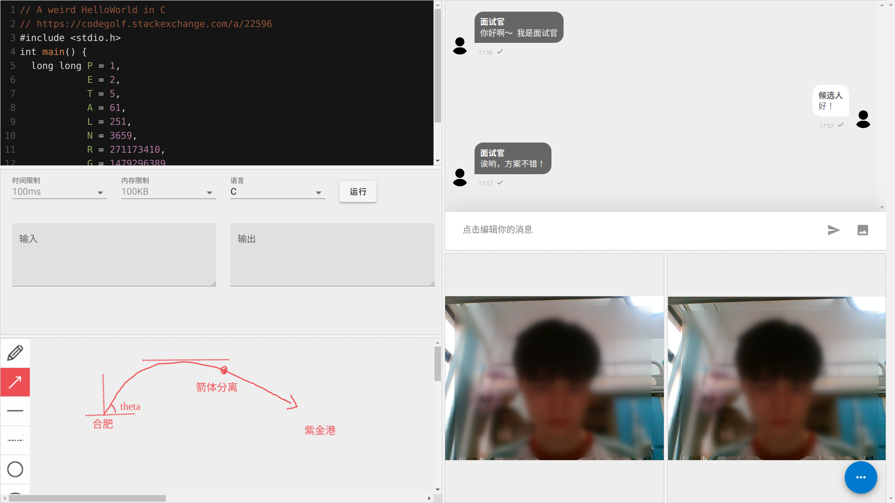

# Online Interview

在线面试平台（软件工程课程项目）。

# 地址

**前端**

<https://interview.yusanshi.com/>

**文档**

<https://i-m-feeling-lucky.github.io/>

**后端**

<https://interview.wangrc.top/api>

**RTC Socket URL**

<https://rtc.yusanshi.com/>

# 示例页面

**登录**

**HR 管理面试**

**面试界面 - 面试官**

**面试界面 - 候选人**

# 演示视频

<https://storage.yusanshi.com/online-interview.mp4>
